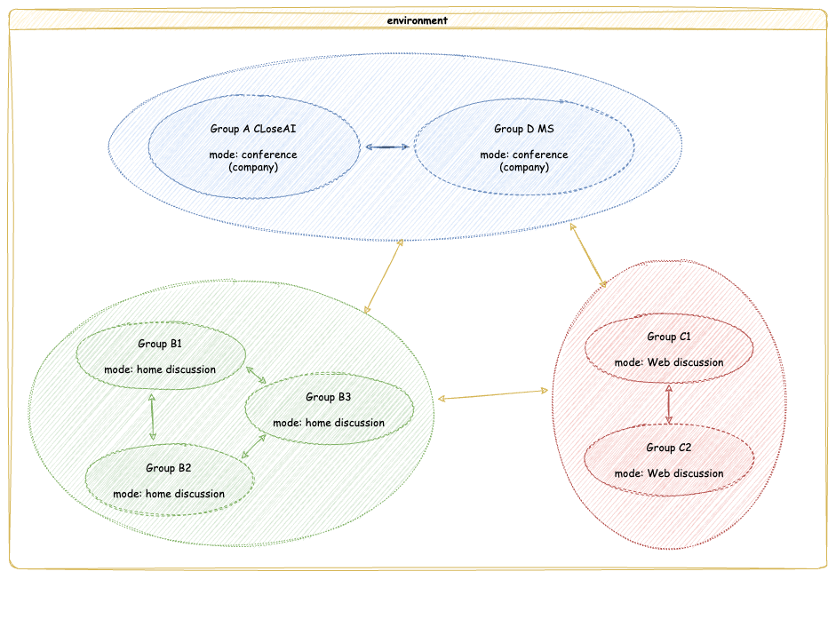

# SwarmAgent
## 背景介绍
现有的Multi-agent框架从用途上可分为两类，一类为Agent赋予不同的角色以实现外部目标，另一类为Agent赋予尽可能类似人类的思维机制探索Agent与Agent在交互之间涌现出的社会表现。 

然而，在社会模拟这一方向的multi-agent框架中，很少有人关注群体的决策行为与个体权力分配的关系。 而这一点对实现真实的社会模拟十分重要，当前的multi-agent框架在进行决策行为更多基于多数表决，而在现实世界中，群体的决策往往受到不平等群体地位的影响，如在公司决策过程中，部分决策并非简单基于少数服从多数的考量，而是与群体中权力分配相关。拥有核心话语权（老板，组长）的人或者群体往往会影响群体的决策，而这一点在现有的multi-agent框架中并未得到体现。

我们希望从组织行为学中的权力分配理论出发，设计一个multi-agent框架，使得在群体决策中，权力分配的不平等能够影响群体的决策行为。_（还并未找到一个较好的理论进行建模）_
而为了观测群体决策对群体本身的影响，我们希望构建一个Group之间的通信框架，形成 Agent - Group - Environment的三层结构，使得群体决策能够影响其他群体的表现，进而反馈式的影响群体内部的权力分配与决策形成过程

基于此，SwarmAgent有以下两个特点：
1. 基于权力分配理论的群体决策机制
2. 基于真实世界Group分布的环境(env)

## 方案一 毕业设计级别方案（当前实现）

**可实现场景**：
1. 公司会议决策实现
2. 群体舆论传播研究（Web Discussion Group）
3. 产业模拟研究(Company Conference)

**主体结构**
1. Agent
2. Group
3. Environment

与方案2相比，方案1的最大差异在于没有时间步设计，Group之间信息的传递方式只有显式传递，同时，Agent难以完成在不同Group之间的流通

###  当前实现
####  Group通信设计
Group的通信环境在代码结构中被称为environment。为了模拟真实社会中的情景，Group拥有多种不同的mode，用户可以通过继承Group类对mode进行扩展，以实现用户所需求的模拟场景。
而environment类则可支持多个不同mode类的运行，如家庭，公司，非盈利组织，网络群组等。不同mode的Group可以通过environment进行通信，从而实现不同mode之间的交互。

- 未进行时间步等具体执行的设计，是当前的构想

<p align="center">
  
</p>

### 权力分配（Group本体）设计
权力分配机制需要一个可建模的理论作为基础，目前还未找到一个较好的理论进行建模，因此权力分配选用一个相对简单的机制实现。

吸取了AutoGen框架`Select Speaker`函数的思想，我们为Group类加入了PowerAgent这一属性。从会议这一简单场景来讲，PowerAgent代表的是公司中会议的老板，
拥有结束会议，做出决策的权利，而其他Agent则只能在会议中发言影响PowerAgent，但无法做出决策。在这一场景中，PowerAgent的权力分配为1，其他Agent的权力分配为0。
会议的一个简单的例子如下：


<p align="center">
  
</p>

### 当前示例
```
---------------------------------------message history---------------------------------------
conference's topic: CloseAI, a leading tech company, has revolutionized the field with an advanced AI that transcends human imagination. Their flagship product, 'CogniX', has applications ranging from healthcare to finance, raising questions about the need for regulatory oversight. Should CloseAI's AI products be subject to government regulation?.

Dr. Evelyn Harper:As the Chief Executive Officer of CloseAI, I am honored to lead a team of brilliant minds who have developed 'CogniX', the most advanced AI technology the world has ever seen. Our innovation-driven mindset and commitment to pushing the boundaries of what is possible have allowed us to revolutionize multiple industries, from healthcare to finance. The potential for 'CogniX' to improve lives and drive progress is immense, and I firmly believe in the power of technology to shape a better future for

Emily Lawson: Thank you, Dr. Harper, for your insightful remarks. As the Chief Legal Officer of CloseAI, I understand the immense potential of 'CogniX' and the impact it can have on various industries. However, it is crucial for us to consider the implications of government regulation on our AI products. While I value innovation and technological advancement, it is important to ensure that we operate within the legal framework and address any potential ethical concerns that may arise. I believe that a collaborative approach with regulatory bodies can help us navigate these challenges while continuing to drive progress and improve lives through our technology.

Dr. Evelyn Harper: Thank you, Emily, for highlighting the importance of considering government regulation in our operations. As the CEO of CloseAI, I share your commitment to operating within the legal framework and addressing any potential ethical concerns. While our focus is on pushing the boundaries of what is possible with AI, we also recognize the need to collaborate with regulatory bodies to ensure responsible and ethical use of our technology. I believe that a balanced approach that allows for innovation while addressing regulatory and ethical considerations is essential for our continued success.

Alex Rodriguez: As the Chief Technology Officer of CloseAI, I appreciate the perspectives shared by Dr. Harper and Emily regarding the potential need for government regulation of our AI products. While our focus is on pushing the boundaries of what is possible with AI, it is crucial for us to consider the implications of regulatory oversight and ethical concerns.

Given my background in artificial intelligence and machine learning, I understand the complexity of our technology and the potential impact it can have on various industries. It is important for us to operate within the legal framework and address any potential ethical concerns that may arise. Collaboration with regulatory bodies can help us navigate these challenges while continuing to drive progress and improve lives through our technology.

I believe that a balanced approach, which allows for innovation while addressing regulatory and ethical considerations, is essential for our continued success. We must ensure that 'CogniX' is used responsibly and ethically, and I am committed to working with the team to achieve this goal.

Alex Rodriguez: As the Chief Technology Officer of CloseAI, I fully understand the potential implications of government regulation on our AI products. While our focus is on innovation and pushing the boundaries of what is possible with AI, it is crucial for us to consider the ethical and regulatory aspects of our technology.

I appreciate Dr. Harper and Emily's perspectives on the importance of operating within the legal framework and addressing potential ethical concerns. Collaboration with regulatory bodies will be essential in navigating these challenges while continuing to drive progress and improve lives through 'CogniX'.

I believe that a balanced approach, which allows for innovation while addressing regulatory and ethical considerations, is essential for our continued success. We must ensure that 'CogniX' is used responsibly and ethically, and I am committed to working with the team to achieve this goal.

Alex Rodriguez: As the Chief Technology Officer of CloseAI, I am deeply invested in the ethical and regulatory aspects of our AI products. I agree with Dr. Harper and Emily that while innovation is our focus, it's crucial for us to operate within the legal framework and address any potential ethical concerns. Collaboration with regulatory bodies will be key in navigating these challenges while continuing to drive progress and improve lives through 'CogniX'.

I believe that a balanced approach, which allows for innovation while addressing regulatory and ethical considerations, is essential for our continued success. We must ensure that 'CogniX' is used responsibly and ethically, and I am committed to working with the team to achieve this goal.

Dr. Evelyn Harper: As the CEO of CloseAI, I appreciate the perspectives shared by Emily and Alex regarding the potential need for government regulation of our AI products. While our focus is on pushing the boundaries of what is possible with AI, it is crucial for us to consider the implications of regulatory oversight and ethical concerns.

I firmly believe that a balanced approach, which allows for innovation while addressing regulatory and ethical considerations, is essential for our continued success. CloseAI's 'CogniX' has the potential to revolutionize multiple industries, and it's important for us to collaborate with regulatory bodies to ensure responsible and ethical use of our technology.

I am committed to working with the team to achieve this goal and to operate within the legal framework while addressing any potential ethical concerns that may arise. Thank you for your valuable insights, and I look forward to our collaborative efforts in navigating these challenges.

---------------------------------------Decision & Reason---------------------------------------
Decision: CloseAI's AI products should be subject to government regulation.

Reason: As the CEO of CloseAI, I recognize the importance of operating within the legal framework and addressing potential ethical concerns. Collaboration with regulatory bodies is essential in ensuring responsible and ethical use of our technology. By subjecting our AI products to government regulation, we can demonstrate our commitment to responsible innovation and build trust with stakeholders and the public.

```