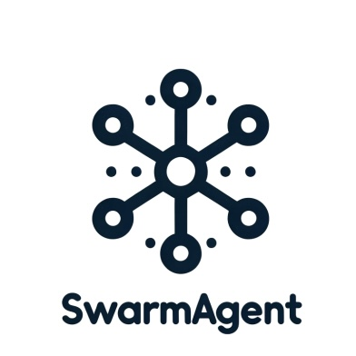
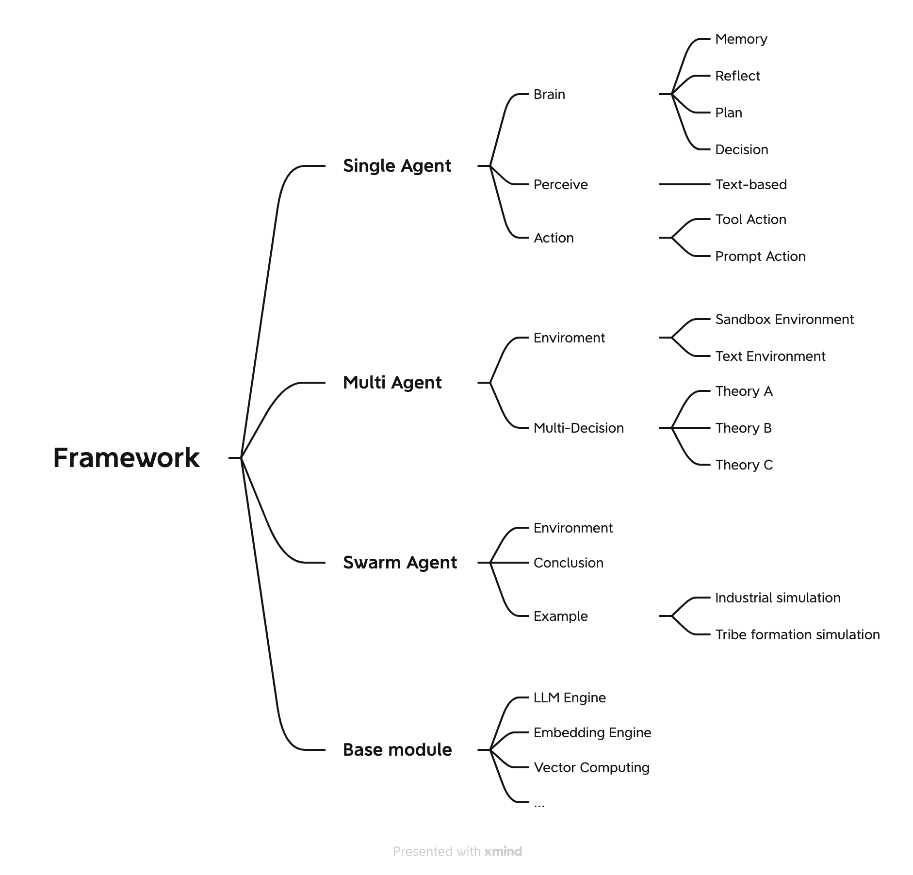

# SwarmAgent
SwarmAgent: A framework for simulating social group dynamics using multi-agent collaboration, aiding insights into collective behaviors and decision-making.

  

## Code Framework
We focus on the implementation of collective decision-making and have added a new Environment layer on top of the existing MultiAgent framework to facilitate the transmission of information between different Agent Groups. This setup allows us to observe the impact of collective decision-making on the group during their interactions.

  

Our goal is to build a modular framework where simulations of group decision-making can be realized simply by modifying the SwarmAgent layer, without the need to alter the Single Agent or MultiAgent framework.