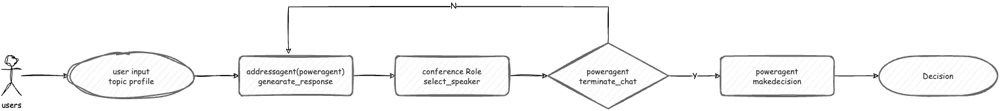

# SwarmAgent
## 背景介绍
现有的Multi-agent框架从用途上可分为两类，一类为Agent赋予不同的角色以实现外部目标，另一类为Agent赋予尽可能类似人类的思维机制探索Agent与Agent在交互之间涌现出的社会表现。 

然而，在社会模拟这一方向的multi-agent框架中，很少有人关注群体的决策行为与个体权力分配的关系。 而这一点对实现真实的社会模拟十分重要，当前的multi-agent框架在进行决策行为更多基于多数表决，而在现实世界中，群体的决策往往受到不平等群体地位的影响，如在公司决策过程中，部分决策并非简单基于少数服从多数的考量，而是与群体中权力分配相关。拥有核心话语权（老板，组长）的人或者群体往往会影响群体的决策，而这一点在现有的multi-agent框架中并未得到体现。

我们希望从组织行为学中的权力分配理论出发，设计一个multi-agent框架，使得在群体决策中，权力分配的不平等能够影响群体的决策行为。_（还并未找到一个较好的理论进行建模）_
而为了观测群体决策对群体本身的影响，我们希望构建一个Group之间的通信框架，形成 Agent - Group - Environment的三层结构，使得群体决策能够影响其他群体的表现，进而反馈式的影响群体内部的权力分配与决策形成过程

基于此，SwarmAgent有以下两个特点：
1. 基于权力分配理论的群体决策机制
2. 容纳多个Group的通信环境

## 当前实现
### Group通信设计
Group的通信环境在代码结构中被称为environment。为了模拟真实社会中的情景，Group拥有多种不同的mode，用户可以通过继承Group类对mode进行扩展，以实现用户所需求的模拟场景。
而environment类则可支持多个不同mode类的运行，如家庭，公司，非盈利组织，网络群组等。不同mode的Group可以通过environment进行通信，从而实现不同mode之间的交互。

- 未进行时间步等具体执行的设计，是当前的构想

### 权力分配（Group本体）设计
权力分配机制需要一个可建模的理论作为基础，目前还未找到一个较好的理论进行建模，因此权力分配选用一个相对简单的机制实现。

吸取了AutoGen框架`Select Speaker`函数的思想，我们为Group类加入了PowerAgent这一属性。从会议这一简单场景来讲，PowerAgent代表的是公司中会议的老板，
拥有结束会议，做出决策的权利，而其他Agent则只能在会议中发言影响PowerAgent，但无法做出决策。在这一场景中，PowerAgent的权力分配为1，其他Agent的权力分配为0。
会议的一个简单的例子如下：

  

