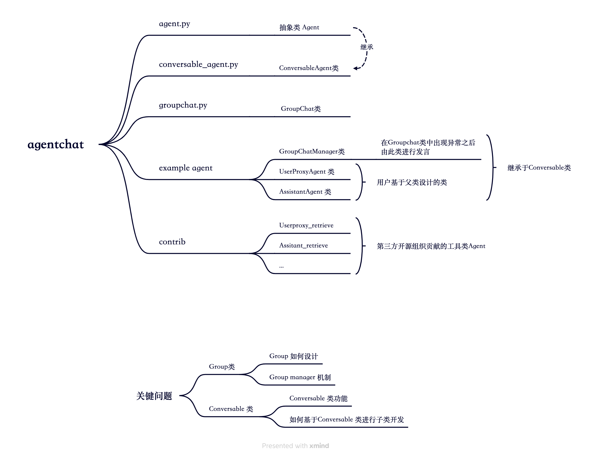

# 框架分析

## 功能分析

1. 可重用，可定制的Agent模块
2. 支持Human in the loop （工具类Agent有会更好）

## 焦点分析

我们不应该太过关注AutoGen中的一些SOP方式，重点落在

1. 代码的整体结构
2. LLM Engine 使用
3. Config List配置与自定义化工具（Action的List）

## 整体观感

pass

# 代码分析

## agentchat模块

agent chat模块为autogen的核心模块。在这一模块中包含多Agent框架最为关键的两个要素：Environment与单Agent。前者体现为Groupchat，后者体现为Conversable agent。

### **Groupchat**

Autogen在Groupchat中引入一个加强鲁棒性的机制，通过设置Groupmanager与human in the loop显著降低了程序崩溃的可能性，使得框架在Agent对话出现错误之后也能够及时纠正，从而保证一个满意的结果。

Groupchat的广播机制值得详细研究。
1. 在Group中，发言顺序由Groupchat的方法决定，当Group需要一个具备特定Function的Agent时，Group会使用functionfliter对Agent进行过滤，使得能发言的Agent仅能从满足条件的Agent出现。
2. 同时，Group中，Chat将会被传播给所有Agent，由1中提到的选择下一个发言者发言之后迭代这个过程直到达到Max round
3. 当选定发言的Agent没有做出响应时，轮次结束；当出现Keyboraderror或其他错误时，Groupmanager将会成为发言者接管群聊，使得群聊可以继续

**来自GPT的详细讲解**

> 这段代码中的广播机制主要在 run_chat 和 a_run_chat 方法中实现。
> 在每一轮聊天中，当前的发言者（speaker）会生成一条消息（message）。这条消息会被广播给除发言者外的所有代理。广播的实现是通过遍历群聊中的所有代理（agent），如果代理不是发言者，就调用 self.send 或 self.a_send 方法向该代理发送消息。这里的 request_reply 参数设置为 False，表示发送消息后不请求回复，silent 参数设置为 True，表示在发送消息后不打印日志。
> 当代理收到消息后，如果它被选为下一个发言者，它会调用 generate_reply 或 a_generate_reply 方法生成回复。这个回复会被添加到群聊的消息列表中，并在下一轮中被广播给其他代理。
> 如果在选择下一个发言者时被中断（例如，由于键盘中断），管理员代理（admin agent）会被选为发言者，以恢复群聊。管理员代理生成的回复同样会被添加到群聊的消息列表中，并在下一轮中被广播给其他代理。
> 这个广播机制确保了群聊中的所有代理都能收到其他代理的消息，并在被选为发言者时有机会回复。

### **Conversable Agent**

AutoGen在单Agent的设计中体现出了“拟人类”多Agent框架与“工具类”多Agent框架的显著差异。AutoGen单Agent的设计基于一个抽象类Agent，并在其基础上进行了通用的可对话类Conversableagent类实现。随后提供出一个方便扩展Action与Agent特性的借口。

研究问题

1. Conversable类设计功能（工具类Agent是如何设计单Agent类的）
2. Conversable类如何扩展（查看官方扩展，重点研究问题，但是不必太过深入）
