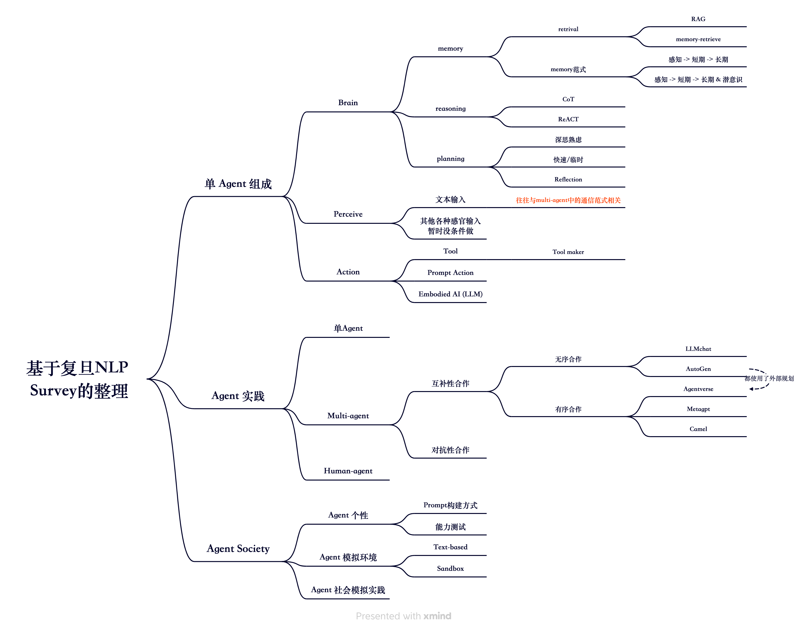

#slide 

#  LLM-based-Agent 主题分享

LLM-based-Agent分享，聚焦multi-agent Framework

当前的Multi-Agent研究整体从用途上整体可以分为两种，第一种为目标任务型，第二种为社会模拟型。前者的研究在今年的4-10月份之间爆炸式发展，从4月份AutoGPT，BabyAGI等单Agent框架到LLMChat，Camel（双Agent框架），MetaGPT，AgentVerse，AutoGen，XAgent等MultiAgent框架，大多聚焦于外部目标的task-solving，其中一些框架也完成了社会模拟的实验（MetaGPT & AgentVerse）。后者的研究相对较少，Generative Agents与继承其大部分特性的Humanoid Agents成为两个焦点作品。除去这两种比较通用的类型之外，也出现了像RecAgents这样聚焦于某个场景的社会模拟框架。因此相较于前者，后者的研究依旧处于相对空白的阶段，潜力较大。

> 除去框架工作之外，如Voyager（我的世界Agent），狼人杀Agent等工作也有一定反响；最近出现了一篇Agent模拟奥运会场景的论文

## 近期工作

1. MetaGPT Generative Agents 复刻实验
2. 复旦NLP Survey 
3. AutoGen 框架分析
4. Humanoid 分析
5. RecAgents 陈旭老师联络

## 论文分享

#### Fudan NLP Survey

参考解读：[复旦NLP Survey](https://zhuanlan.zhihu.com/p/656676717)

> 社会模拟可分为宏观模拟和微观模拟。在宏观层面的仿真中，也称为基于系统的仿真，研究人员模拟仿真社会系统的整体状态。而在微观层面的仿真中，**也称为基于Agent的仿真或多Agent系统（MAS）**，研究人员通过对个人建模来间接模拟社会。随着LLM-based Agent的发展，微观仿真近来越来越受到重视。本文将“Agent Society”定义为一个开放、持久、情景化和有组织的框架，在这个框架中，LLM-based Agent在一个确定的环境中相互影响，这些属性中的每一个都在塑造模拟社会的和谐外观方面发挥着关键作用。
>
> - **开放性**。模拟社会的决定性特征之一在于其开放性，包括其组成人员和环境组成部分的开放性。Agent是这类社会的主要参与者，可以灵活地进入或离开环境，而不会破坏其运行的完整性。此外，这一特点还延伸到环境本身，它可以通过添加或删除虚拟或物理世界中的实体以及工具 API 等可调整资源来扩展。此外，人类还可以通过扮演Agent角色或充当指导这些Agent的思想来参与社会。这种固有的开放性为模拟增加了另一层复杂性，模糊了模拟与现实之间的界限。
> - **持久性**。我们期望模拟社会具有持久性和可持续性。虽然社会中的单个Agent在每个时间步长内的行动都是自主的，但整体组织结构会随着时间的推移而持续存在，在一定程度上脱离了单个Agent的短暂行为。这种持续性创造了一种环境，使行为主体的决策和行为得以累积，从而形成一个随着时间推移而发展的连贯的社会轨迹。该系统独立运行，在促进社会稳定的同时，也兼顾了参与者的动态性质。
> - **情境性**。社会的情境性强调社会在一个独特的环境中存在和运行。这种环境是事先人为或自动构建的，Agent在其中有效地执行其行为和进行互动。这一特性的一个值得注意的方面是，Agent拥有对其空间环境的意识，了解自己在环境中的位置和视野范围内的物体。这种意识有助于提高它们主动与环境互动的能力。
> - **有组织**。模拟社会在一个精心组织的框架内运行，与现实世界中的系统结构如出一辙。就像物理世界遵循物理学原理一样，模拟社会也在预定义的规则和限制范围内运行。在模拟世界中，Agent在有限的行动空间内与环境互动，而环境中的物体则在有限的状态空间内转换。所有这些规则决定了Agent如何运作，促进了模拟中的通信连接和信息传输路径等方面。这种组织框架确保了操作的连贯性和可理解性，最终使模拟不断发展，但又经久不衰，反映了现实世界系统的错综复杂。

#### Generative Agents

[MetaGPT复刻活动 斯坦福小镇介绍](https://deepwisdom.feishu.cn/docx/VHYKdDQZWoIlamxdqtvcAi2knig?from=from_copylink)

#### Humanoid Agents

代码阅读：相对简洁，仅仅在Generative Agents基础上封装了一层 humanoid Agents类，添加了快速反应的思维模式

#### MetaGPT

1. 通信模式（订阅-发布）
2. 标准SOP工作流

#### AutoGen

[Autogen阅读笔记](https://github.com/didiforgithub/SwarmAgent/blob/main/notes/autogen/AutoGen%E6%A1%86%E6%9E%B6%E5%88%86%E6%9E%90.md)

#### Agentverse

动态调度Agents

#### RecAgents

1. 使用结构化数据生成Agents profile
2. 使用多API Key 与 Client加速实验轮数
3. 2500个Agents，并不是同时进行，而是使用了概率分布

#### 腾讯数字人

[腾讯双Agent直播&太空狼人杀实现方案详解](https://mp.weixin.qq.com/s/vkP3urjkcT9u9hT1-SvL-Q)

#### 特性总结

human in the loop

LLM-generate Agents Profile

外部规划

inner voice 引导 Agent产生实验想法

## SwarmAgent

目标是提供一个社会学科模拟的Multi-agent框架，与其他Simultaion multi-agents差异在

1. 更接近真实社会的Agent地位设置（即平等到不平等）
2. 群体决策模拟

#### 更真实Agent关系模拟

当视角聚焦到一个微观的Group上时，个体之间的关系往往是不平等的。如家庭，公司，学校等常见社会群体中。

1. Agent Profile 设定关系
2. Agent通信中设定 PowerAgent

#### 群体决策模拟 & 群体关系模拟

群体的决策并非全部是多数表决（这句话来源在哪里来着，得看一下），甚至并非是高权位>低权位，群体的决策在一定程度上会受到无决策权但具有实际行动权的角色影响

###  讨论思考
1. 通过 PowerAgent的设置，启发一个思路，网络群组聊天 （单Group研究）
   1. 查看PowerAgent是否会自然出现（意见领袖）与转移
   2. 查看话题是否会转移？如果转移的话是否跟意见领袖相关
2. 研究多Group - 群落模拟，查看行为权与决策权的失衡能够带来哪些结果，影响群落
3. 最终目的，我是要做一个可插拔的框架，可以通过自定义Group与Agent Profile来实现各种场景的模拟
